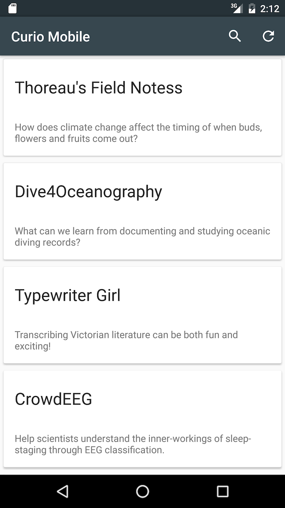
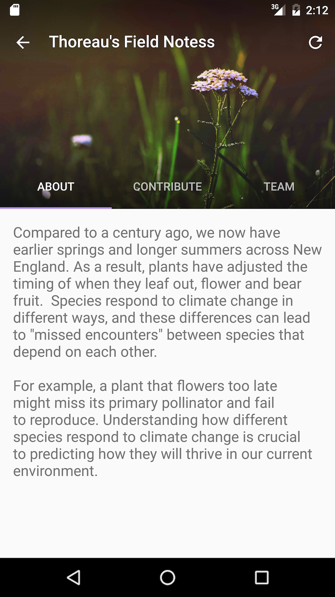

# CurioMobile

CurioMobile is an Android Application which interfaces with the [Curio test API.](http://test.crowdcurio.com/api/project/) 

This was my submission University of Waterloo's CS349 (User Interfaces) assignment 4. 

To see a web application utilizing this API visit http://test.crowdcurio.com/

For more information about Curio please visit https://www.crowdcurio.com/

## Screenshots

## Running 

Import the project into Android Studio and deploy to a device.

## Notes

You can refresh the page on any screen by taking advantage of the pull-to-refresh feature.

I also take advantage of the built in Pallete class so that the toolbar colour is automatically extracted from the banner image. Note that this only occurs if the banner image has colours that are distinct and bright enough for extraction.

This app should work properly on any screen size, I designed it with this in mind. 

##Icons

The icons used for the tools are the Material Design icons produced by Google. See https://design.google.com/icons/ 
for the icons. The icons are licensed under Creative Commons Attribution 4.0 International License (CC-BY 4.0) 
(http://creativecommons.org/licenses/by/4.0/)
